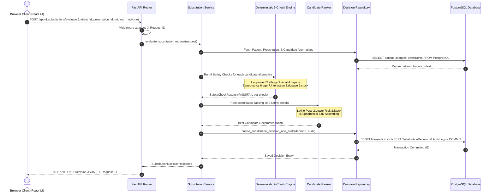
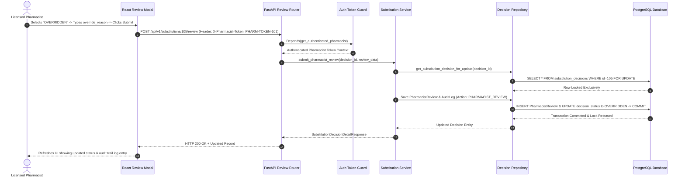
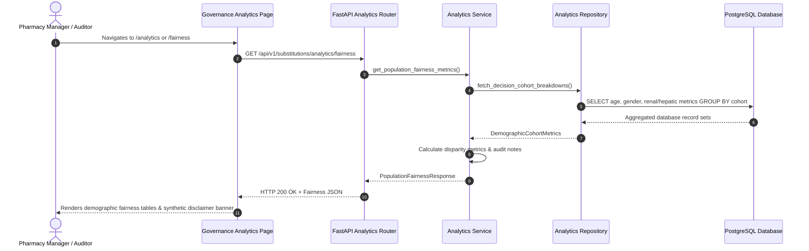

# System Architecture — Pharmacy Substitution Decision Support System

This document describes the high-level architecture, component layers, data flows, and sequence flowcharts for the Pharmacy Substitution Decision Support System.

---

## High-Level Component Layers

```
┌─────────────────────────────────────────────────────────────────────────┐
│                     React 18 + Vite Web Application                     │
│    (Dashboard, Evaluate, History, Analytics, Fairness, Error Audit)     │
└────────────────────────────────────┬────────────────────────────────────┘
                                     │ (HTTP REST API + X-Request-ID + X-Pharmacist-Token)
                                     ▼
┌─────────────────────────────────────────────────────────────────────────┐
│                       FastAPI REST API Layer (v1)                       │
│    (Request Routing, Parameter Validation, Security Headers, Middleware)│
└────────────────────────────────────┬────────────────────────────────────┘
                                     │
                                     ▼
┌─────────────────────────────────────────────────────────────────────────┐
│                    Substitution Service Orchestration                   │
│   (Coordinates Engine, Repositories, Atomic Transactions, & Audit Logs) │
└───────────────────┬─────────────────────────────────┬───────────────────┘
                    │                                 │
                    ▼                                 ▼
┌──────────────────────────────────────┐   ┌──────────────────────────────┐
│  Deterministic 9-Check Safety Engine │   │ Deterministic Candidate      │
│  (Allergy, Renal, Hepatic, Age, etc) │   │ 5-Tier Priority Ranking      │
└──────────────────────────────────────┘   └──────────────────────────────┘
                                     │
                                     ▼
┌─────────────────────────────────────────────────────────────────────────┐
│                        SQLAlchemy ORM Repositories                      │
│            (Pessimistic Row Locking FOR UPDATE & Transactions)          │
└────────────────────────────────────┬────────────────────────────────────┘
                                     │ (psycopg DBAPI Driver)
                                     ▼
┌─────────────────────────────────────────────────────────────────────────┐
│              PostgreSQL Database (pharmacy_substitution_db)             │
└─────────────────────────────────────────────────────────────────────────┘
```

---

## 1. Decision Evaluation Data Flow Sequence



---

## 2. Pharmacist Review & Clinical Override Workflow Sequence



---

## 3. Governance Analytics Data Flow Sequence


