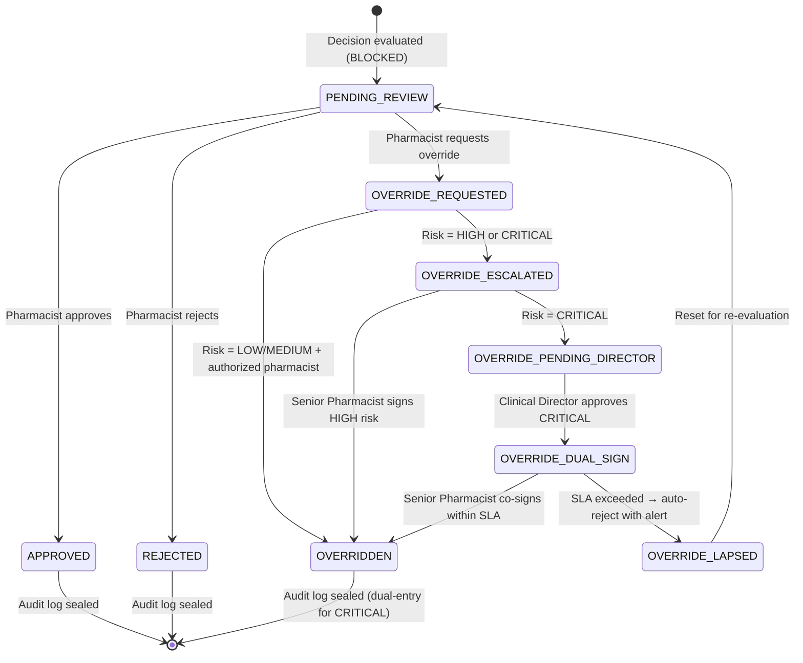

# Role-Based Access Control & Clinical Override Sign-Off Workflows

> **Milestone Specification** — Subsequent Milestone Design Reference  
> System: Pharmacy Substitution Decision Support System  
> Status: **Designed / Pending Implementation** (current prototype uses header-token authentication)

---

## 1. Overview

This document specifies the formal Role-Based Access Control (RBAC) model and
high-risk clinical override sign-off workflow that will govern pharmacist
interactions with the decision support system in subsequent milestones.

The current system uses a **prototype header-token guard** (`X-Pharmacist-Token`)
that validates presence and rejects known-invalid literals. This milestone design
replaces that mechanism with a structured RBAC layer backed by signed JWT tokens
and a multi-step override sign-off flow for high-risk (`CRITICAL` / `HIGH`) safety
blocks.

---

## 2. Role Taxonomy

### 2.1 Defined Roles

| Role ID | Display Name | Description |
|---|---|---|
| `PHARMACIST` | Staff Pharmacist | Reviews and approves standard (LOW/MEDIUM risk) substitution decisions. Cannot override CRITICAL safety blocks without escalation. |
| `SENIOR_PHARMACIST` | Senior Pharmacist | All PHARMACIST permissions plus authority to issue HIGH-risk overrides with documented justification. |
| `CLINICAL_DIRECTOR` | Clinical Director / Chief Pharmacist | Full override authority including CRITICAL safety blocks. Signs off on escalated overrides within 4 hours. |
| `PHARMACY_MANAGER` | Pharmacy Manager | Read-only access to all decisions, analytics, fairness metrics, and audit logs. Cannot submit reviews. |
| `AUDITOR` | Compliance Auditor | Read-only access to audit logs and fairness/analytics endpoints. No access to patient PII beyond what is required for audit purposes. |
| `SYSTEM_ADMIN` | System Administrator | Manages user accounts, role assignments, and system configuration. No clinical decision authority. |

### 2.2 Role Hierarchy

```
CLINICAL_DIRECTOR
      ├── SENIOR_PHARMACIST
      │         └── PHARMACIST
PHARMACY_MANAGER  (parallel, read-only)
AUDITOR           (parallel, read-only)
SYSTEM_ADMIN      (orthogonal, no clinical access)
```

---

## 3. Permission Matrix

| Permission | PHARMACIST | SENIOR_PHARMACIST | CLINICAL_DIRECTOR | PHARMACY_MANAGER | AUDITOR |
|---|:---:|:---:|:---:|:---:|:---:|
| `POST /evaluate` | ✅ | ✅ | ✅ | ❌ | ❌ |
| `GET /{id}` | ✅ | ✅ | ✅ | ✅ | ❌ |
| `POST /{id}/review` — APPROVED | ✅ | ✅ | ✅ | ❌ | ❌ |
| `POST /{id}/review` — REJECTED | ✅ | ✅ | ✅ | ❌ | ❌ |
| `POST /{id}/review` — OVERRIDDEN (LOW/MEDIUM risk) | ✅ | ✅ | ✅ | ❌ | ❌ |
| `POST /{id}/review` — OVERRIDDEN (HIGH risk) | ❌ | ✅ | ✅ | ❌ | ❌ |
| `POST /{id}/review` — OVERRIDDEN (CRITICAL risk) | ❌ | ❌ | ✅ | ❌ | ❌ |
| `GET /analytics/summary` | ❌ | ✅ | ✅ | ✅ | ✅ |
| `GET /analytics/fairness` | ❌ | ✅ | ✅ | ✅ | ✅ |
| `GET /analytics/error-analysis` | ❌ | ✅ | ✅ | ✅ | ✅ |
| `GET /audit-logs` (planned) | ❌ | ✅ | ✅ | ✅ | ✅ |
| User management (planned) | ❌ | ❌ | ❌ | ❌ | ❌ |

> ✅ = Permitted  ❌ = Denied (HTTP 403 Forbidden)

---

## 4. Clinical Override Sign-Off Workflow

### 4.1 Override Risk Tiers

| Safety Block Risk Level | Required Approver Role | Sign-Off SLA | Dual Sign-Off Required |
|---|---|---|---|
| `LOW` | PHARMACIST | Immediate | No |
| `MEDIUM` | PHARMACIST | Immediate | No |
| `HIGH` | SENIOR_PHARMACIST | ≤ 2 hours | No (single senior sign-off) |
| `CRITICAL` | CLINICAL_DIRECTOR | ≤ 4 hours | **Yes** — dual sign-off (CLINICAL_DIRECTOR + SENIOR_PHARMACIST) |

### 4.2 Override State Machine



### 4.3 Step-by-Step Override Flow (HIGH-risk Example)

1. **Evaluation** — System evaluates substitution; result is `BLOCKED` with `risk_level=HIGH`.
2. **Initial Review Request** — Staff Pharmacist (`PHARMACIST`) views decision. Role guard rejects override attempt with `HTTP 403`.
3. **Escalation** — Staff Pharmacist routes decision to Senior Pharmacist (`SENIOR_PHARMACIST`) by setting status `OVERRIDE_REQUESTED` + justification.
4. **Senior Sign-Off** — Senior Pharmacist reviews clinical evidence, supplies mandatory `override_reason` (minimum 30 characters), and submits `OVERRIDDEN`.
5. **Audit Persistence** — Two `AuditLog` entries created atomically:
   - `OVERRIDE_REQUESTED` — actor: Staff Pharmacist code, timestamp, justification.
   - `PHARMACIST_OVERRIDE` — actor: Senior Pharmacist code, timestamp, full override reason.
6. **Notification** — Pharmacy Manager receives real-time notification of HIGH-risk override event.

### 4.4 Step-by-Step Override Flow (CRITICAL-risk Example)

1. **Evaluation** — System evaluates substitution; result is `BLOCKED` with `risk_level=CRITICAL`.
2. **Override Request** — Senior Pharmacist submits `OVERRIDE_REQUESTED` with documented justification.
3. **Director Escalation** — System auto-escalates to Clinical Director queue. SLA timer starts (4-hour window).
4. **Director First Sign-Off** — Clinical Director reviews full clinical context and override justification. Approves with `override_reason` ≥ 50 characters.
5. **Dual Sign-Off Requirement** — System moves to `OVERRIDE_DUAL_SIGN` state. Senior Pharmacist must co-sign within 4 hours.
6. **Co-signature** — Senior Pharmacist co-signs, confirming clinical agreement. Status moves to `OVERRIDDEN`.
7. **SLA Lapse Handling** — If co-signature is not received within 4 hours, the system transitions to `OVERRIDE_LAPSED`, sends alerts, and resets the decision to `PENDING_REVIEW` for re-evaluation.
8. **Immutable Audit Trail** — Four `AuditLog` entries created:
   - `OVERRIDE_REQUESTED` — staff initiator
   - `OVERRIDE_ESCALATED` — system-generated escalation record
   - `OVERRIDE_DIRECTOR_APPROVED` — Clinical Director first sign-off
   - `PHARMACIST_OVERRIDE` — Senior Pharmacist co-signature

---

## 5. JWT-Based Authentication Design (Planned)

Replace prototype `X-Pharmacist-Token` with OAuth2 + OIDC signed JWT tokens.

### 5.1 JWT Payload Structure

```json
{
  "sub": "PHARM-101",
  "name": "Jane Smith",
  "role": "SENIOR_PHARMACIST",
  "license_number": "GPC-2024-00891",
  "institution_id": "HOSP-MAIN",
  "iat": 1727627144,
  "exp": 1727630744,
  "jti": "d4f3b2a1-..."
}
```

### 5.2 Role Validation Dependency (Pseudocode)

```python
from fastapi import Depends, HTTPException, status
from app.core.jwt import decode_token

ROLE_HIERARCHY = {
    "PHARMACIST": 1,
    "SENIOR_PHARMACIST": 2,
    "CLINICAL_DIRECTOR": 3,
}

def require_role(minimum_role: str):
    """FastAPI dependency factory that enforces minimum RBAC role level."""
    def _check(token_payload: dict = Depends(decode_token)) -> dict:
        user_role = token_payload.get("role", "")
        if ROLE_HIERARCHY.get(user_role, 0) < ROLE_HIERARCHY.get(minimum_role, 999):
            raise HTTPException(
                status_code=status.HTTP_403_FORBIDDEN,
                detail=f"Role '{minimum_role}' or higher is required for this action.",
            )
        return token_payload
    return _check

# Applied in route:
@router.post("/{decision_id}/review")
def submit_pharmacist_review(
    decision_id: int,
    review_request: PharmacistReviewRequest,
    actor: dict = Depends(require_role("PHARMACIST")),
    db: Session = Depends(get_db),
):
    ...
```

### 5.3 Risk-Level Role Guard (Pseudocode)

```python
OVERRIDE_RISK_ROLE_MAP = {
    "LOW":      "PHARMACIST",
    "MEDIUM":   "PHARMACIST",
    "HIGH":     "SENIOR_PHARMACIST",
    "CRITICAL": "CLINICAL_DIRECTOR",
}

def validate_override_authority(decision: SubstitutionDecision, actor_role: str):
    """Raise 403 if actor lacks authority to override the decision's risk level."""
    required_role = OVERRIDE_RISK_ROLE_MAP.get(decision.risk_level, "CLINICAL_DIRECTOR")
    if ROLE_HIERARCHY.get(actor_role, 0) < ROLE_HIERARCHY.get(required_role, 999):
        raise HTTPException(
            status_code=status.HTTP_403_FORBIDDEN,
            detail=(
                f"Risk level '{decision.risk_level}' overrides require "
                f"role '{required_role}' or higher. "
                f"Your role '{actor_role}' is insufficient."
            ),
        )
```

---

## 6. Audit Trail Requirements for Overrides

All pharmacist override actions must generate immutable `AuditLog` entries with
the following mandatory fields:

| Field | Requirement |
|---|---|
| `action` | One of: `OVERRIDE_REQUESTED`, `OVERRIDE_ESCALATED`, `OVERRIDE_DIRECTOR_APPROVED`, `PHARMACIST_OVERRIDE`, `OVERRIDE_LAPSED` |
| `actor_code` | Pharmacist license code / JWT `sub` claim |
| `actor_role` | RBAC role at time of action |
| `previous_status` | Decision status before action |
| `new_status` | Decision status after action |
| `reason` | Full override justification text (minimum character requirements enforced) |
| `created_at` | UTC timestamp (server-assigned, immutable) |
| `request_correlation_id` | `X-Request-ID` UUID from middleware |
| `dual_sign_required` | Boolean — true for CRITICAL risk overrides |
| `cosigner_code` | Second pharmacist code (CRITICAL overrides only) |

---

## 7. Minimum Override Reason Length Requirements

| Risk Level | Minimum `override_reason` Length |
|---|---|
| `LOW` | 10 characters |
| `MEDIUM` | 20 characters |
| `HIGH` | 30 characters |
| `CRITICAL` | 50 characters (Clinical Director) + 30 characters (co-signer) |

---

## 8. Current Prototype Gaps vs. This Specification

| Requirement | Current Prototype State | This Milestone Target |
|---|---|---|
| Authentication | Header token presence check | JWT OIDC signed tokens |
| Role enforcement | None (any token accepted) | RBAC role hierarchy + permission matrix |
| HIGH-risk override guard | None | `require_role("SENIOR_PHARMACIST")` dependency |
| CRITICAL override guard | None | `require_role("CLINICAL_DIRECTOR")` + dual sign-off flow |
| Override reason min. length | Non-empty string check | Tiered minimum character validation |
| Escalation state machine | None | `OVERRIDE_REQUESTED → OVERRIDE_ESCALATED → …` states |
| Dual sign-off | None | Dual `AuditLog` entries + SLA timer + lapse handler |
| Notification system | None | Real-time alerts to Pharmacy Manager on HIGH/CRITICAL events |
| Audit trail actor_role | Not recorded | Stored in `AuditLog.actor_role` |

---

## 9. Implementation Roadmap

| Phase | Deliverable | Prerequisite |
|---|---|---|
| M2.1 | RBAC role enum + `require_role()` dependency | JWT decode middleware |
| M2.2 | Override risk-tier role guard (`validate_override_authority`) | M2.1 |
| M2.3 | Override state machine (`OVERRIDE_REQUESTED`, `OVERRIDE_ESCALATED`) + DB columns | M2.2 |
| M2.4 | Dual sign-off flow for CRITICAL overrides + SLA timer | M2.3 |
| M2.5 | Minimum override reason length validators per risk tier | M2.2 |
| M2.6 | Notification service (email / webhook) for HIGH/CRITICAL overrides | M2.3 |
| M2.7 | Production JWT OIDC integration (e.g., Keycloak / Auth0) | M2.1 |
